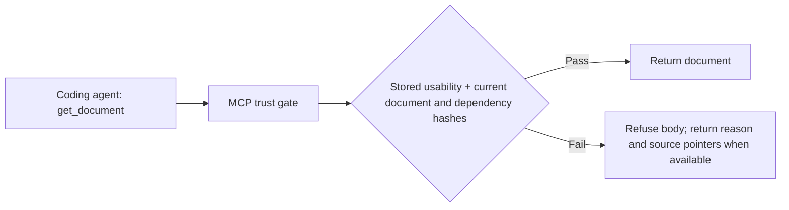

# Doc Governor

AI coding agents treat repository documents as memory. When that memory is stale or unsupported, the cost is wasted work, tokens, and time, slower iteration, and changes nobody can trust.

**Repair documents. Review evidence. Recheck every governed read.**

Doc Governor connects source changes to canonical documents, uses the AWS Strands Agents SDK to review evidence with scoped agents, and serves documents through a read-only MCP trust gate. Trust is bound to recorded evidence and current file hashes.

## Built for professionals shipping with AI

Engineers and small software teams spend time reconciling docs with code, checking whether “verified” claims have evidence, and repeating checks after agent handoffs. Doc Governor handles the repeatable work: repair source-backed documentation, review recorded evidence, organize canonical documents, and flag claims that need a person's judgment.

That gives engineers more time for architecture, product decisions, and reviewing consequential changes. It fits the [Professional Agents track](https://agentsforhumans.devpost.com/resources): an agent that reduces the routine work around skilled human judgment. The demo makes that work visible through concrete repairs, blocked unsupported claims, and check reuse.

## Try it in five minutes

**For judges: start here.** Python 3.12+ and Git are required. The public demo runs in a temporary repository; it needs no AWS credentials, private repository access, or database connection.

```sh
git clone https://github.com/SophieYu04/doc-governor.git
cd doc-governor
python3 -m venv .venv
source .venv/bin/activate
python -m pip install -e '.[dev,mcp,bedrock]'

# Exercise repairs and the real MCP stdio server.
python scripts/demo.py --mcp-stdio --keep

# Verify the implementation, including the Strands graph with a stub model.
PYTHONDONTWRITEBYTECODE=1 python3 -m unittest discover -v
```

The demo prints its temporary repository path and a JSON result. Inspect these outcomes:

| Scenario | Expected result |
| --- | --- |
| An Edge Function is added and the API inventory falls behind | Source-backed inventory is corrected in the canonical contracts. |
| A newly added API note exactly duplicates a canonical document | The eligible duplicate is removed; a read points to the canonical document. |
| A release document refreshes its date without evidence | The document body is refused. |
| Protected public copy changes | The run reports `action_required`; the governor does not overwrite the protected copy. |
| A dependency changes after a trusted read | The next read refuses the formerly trusted document, without another governance run. |
| Recorded production evidence drifts | An `environment_drift` finding makes affected documentation unreadable. |
| A second agent queries recorded checks | Results are reused without rerunning commands; a source change invalidates only affected checks. |

**The decisive test:** a document is readable, its source changes, and the next MCP read refuses it. No model or background audit is needed to catch the change. `action_required` is expected in this demo because it deliberately includes blocked changes.

## How it works

### Before commit and during PR review

The Catalog declares canonical destinations, owners, dependencies, approval rules, and TTLs. The current pre-commit hook asks the developer's configured coding agent to repair required documents, runs verification, and records exact document and dependency hashes. A failed repair command or verification blocks the commit.

```text
Source changes → Catalog dependency matching → bounded repair prompt
  → coding-agent edits → repository verification → hash-bound ledger evidence

PR review → deterministic findings → scoped Strands graph
  → deterministic ruling and conflict checks → eligible corrections + trust.json
```

The pre-commit adapter defaults to Codex and accepts other commands through `DOCGOV_REPAIR_COMMAND`. This local repair path currently does not call Bedrock. PR semantic review uses the Strands graph described below. Model proposals cannot directly authorize edits or stale-status changes; `apply_safe_actions` re-proves eligible duplicate merges and fully grounded contract spans before touching files.

### At every agent read: MCP is read-only



The read path calls no model and makes no network request. Missing or unknown trust-state versions fail closed. Refused documents return no partial content. A source or document change invalidates the stored hashes immediately; TTL is rechecked when trust state is regenerated.

**Trust is evidence-bound, not proof of truth.** The gate depends on accurate Catalog dependencies and verification evidence. It governs MCP reads; it cannot restrict clients from reading raw files through other tools. Doc Governor has no database deployment authority.

## What AWS Strands does

[The implementation](docgov/agents.py) uses real Strands `Agent` nodes, `GraphBuilder`, scoped `@tool` closures, structured output, graph/node timeouts, and `BeforeToolCallEvent` hooks that cancel unauthorized or over-budget calls before execution.

| Agent | Evidence and authority |
| --- | --- |
| **Evidence Auditor** | Reviews one document's claims and recorded evidence. Its own status, `last_verified_at`, and prior Governor conclusions are removed from its input. No source access or writes. |
| **Conflict Resolver** | Receives conflicting documents and Auditor verdicts. Can read only their declared source dependencies; cannot write. |
| **Contract Drafter** | Proposes a span for an eligible contract. Code prevents construction for non-contract, protected, or human-approval documents. Cannot write. |

Deterministic grounding validation rejects unsupported factual tokens, undeclared citations, and invented dates or verification claims. Model failures fail closed. Public traces contain agent, tool, and model identifiers only.

To exercise the graph against **live Amazon Bedrock**, configure AWS credentials with permission to invoke the selected model, then run:

```sh
python scripts/demo.py --enable-model --keep
```

Check for `model_used: true` and the identifier-only `model_trace`. The current default is Claude Sonnet 4 through a US inference profile, configured in [agents.py](docgov/agents.py); `DOCGOV_MODEL_ID` selects another supported Bedrock model, with matching IAM permissions.

[Strands integration tests](tests/test_strands_graph.py) exercise the real graph, tools, hooks, and edge conditions with a stub model. They verify SDK wiring and enforcement; a live Bedrock result requires a separate successful run.

## Use it in your repository

### 1. Declare what governs each document

```sh
python -m pip install 'doc-governor[mcp]'
docgov init
```

Review the generated Catalog proposal and register documents in `.docgov/catalog.yaml`. Use the [public example Catalog](examples/supabase-demo/.docgov/catalog.yaml) as a starting point. The five types are `contract` (source-backed specification), `state` (time-limited claim), `procedure` (operating instructions), `evidence` (immutable record), and `decision` (supersedable rationale).

After a maintainer reviews the initial documents and dependencies:

```sh
docgov baseline --approved
docgov review --apply
docgov verify --strict
```

A baseline records hashes; it does not independently prove prose true. Resolve reported findings before relying on a document.

### 2. Repair required documents before commit

Copy [the pre-commit hook](.githooks/pre-commit) into your repository and configure `policies.auto_repair_documents` in its Catalog. Then enable it:

```sh
git config core.hooksPath .githooks
# Uses Codex by default. The hook repairs configured documents and runs verification.
git commit -m "update implementation"

# Or select your own stdin-capable coding agent and repository test command.
DOCGOV_REPAIR_COMMAND='your-agent-command' \
DOCGOV_VERIFY_COMMAND='your-test-command' git commit -m "update implementation"
```

### 3. Connect a coding agent to MCP

Add this server to your client's MCP configuration, replacing the absolute path:

```json
{
  "mcpServers": {
    "docgov": {
      "command": "docgov-mcp",
      "args": ["--root", "/absolute/path/to/your/repo"]
    }
  }
}
```

Ask the agent to use `get_document` for governed documentation. `list_documents` and `document_status` expose usability without bypassing the same checks. `list_verifications` and `verification_status` report reusable command evidence without executing commands.

### 4. Add PR governance and AWS

Copy [the review workflow](.github/workflows/docgov-review.yml). For semantic review, use its GitHub OIDC integration, configure `DOCGOV_AWS_ROLE_ARN`, and adapt the [trust policy](infra/aws/github-oidc-trust-policy.json) and [Bedrock inference policy](infra/aws/bedrock-inference-policy.json) to your account and repository. Fork PRs remain read-only and receive no AWS identity. Use `enable_model: false` for deterministic-only review.

## Inspect the implementation

| Question | Start here |
| --- | --- |
| How are repair prompts and commit checks implemented? | [Repair prompt](docgov/repair.py), [pre-commit hook](.githooks/pre-commit) |
| How are model proposals constrained? | [Strands agents](docgov/agents.py), [grounding validation](docgov/drafting.py) |
| Why was a read allowed or refused? | [Trust state](docgov/trust_state.py), [MCP server](docgov/mcp_server.py), [MCP tests](tests/test_mcp_server.py) |
| How can another agent reuse test evidence? | [Verification tests](tests/test_verification.py), `docgov verification --help` |
| How is deployment drift detected? | [Read-only adapter](docgov/supabase_remote.py), `docgov drift --help` |
| Where are dependencies and receipts recorded? | [Catalog](.docgov/catalog.yaml), [append-only ledger](.docgov/ledger.jsonl) |

Environment drift detection compares recorded Supabase Advisor signals, not a complete deployment snapshot. It emits findings; the release workflow decides what to do with them.

Created as a new hackathon project, informed by maintaining a separate private mobile application. No private source, credentials, production data, or deployment artifacts are included.

Apache-2.0 · [License](LICENSE)
