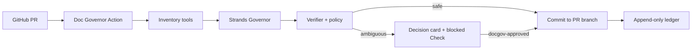

# Doc Governor

Doc Governor is a Strands-powered GitHub Action that governs Markdown created by coding agents. It decides whether a document should be kept, merged, marked stale, or blocked for human review before documentation debt reaches the default branch.

## Why it exists

Coding agents are excellent at producing text and poor at maintaining a small set of authoritative documents. A repository slowly accumulates duplicate API notes, stale status pages, and dates that were changed without evidence. Doc Governor treats documentation as a governed system with five types:

| Type | Lifecycle |
| --- | --- |
| `contract` | Update the canonical document when its source dependency changes. |
| `state` | Expires after a short TTL unless a new verification evidence exists. |
| `procedure` | Requires review when commands or operational dependencies change. |
| `evidence` | Immutable, dated, and never overwritten. |
| `decision` | Superseded by a newer decision instead of silently deleted. |

The agent creates a correction commit on the pull request branch for safe changes. It blocks ambiguous, destructive, legal, public-copy, and unsupported-state changes and leaves a decision card in the pull request. A maintainer adds the `docgov-approved` label to authorize a one-time rerun for the current commit.

The model is reserved for semantic classification and ambiguity. Hashes, dependency matching, TTL checks, path boundaries, trust decisions, and ledger writes are deterministic and can run without AWS.

## Quick start

Requirements: Python 3.12+ and a GitHub repository. An AWS role that can invoke the selected Amazon Bedrock model through GitHub OIDC is needed only when semantic model checks are enabled. Strands supports Python 3.10+; the action uses Python 3.12 for a reproducible runtime. The default install contains only the deterministic engine; install the `bedrock` extra to enable Strands.

1. Add `.docgov/catalog.yaml` to your repository. `docgov init` can generate a proposal.
2. Copy `.github/workflows/docgov-review.yml` from this repository. It checks out pull request content as data, enables write/OIDC access only for same-repository PRs, and runs fork PRs read-only. The essential action step is:

```yaml
name: Doc Governor
on:
  pull_request:
    types: [opened, synchronize, reopened, labeled]
permissions:
  contents: write
  pull-requests: write
  checks: write
jobs:
  govern:
    runs-on: ubuntu-latest
    steps:
      - uses: SophieYu04/doc-governor@v0.1.0
        with:
          mode: review
          base_sha: ${{ github.event.pull_request.base.sha }}
          head_sha: ${{ github.event.pull_request.head.sha }}
          apply: ${{ github.event.pull_request.head.repo.full_name == github.repository }}
          approved: ${{ github.event.action == 'labeled' && github.event.label.name == 'docgov-approved' }}
          enable_model: false
        env:
          GITHUB_TOKEN: ${{ secrets.GITHUB_TOKEN }}
```

3. Configure the role trust policy for GitHub OIDC and grant only `bedrock:InvokeModel` for the chosen model, then enable the guarded Bedrock step in the copied workflow.
4. Run `docgov init` once and review the generated Catalog proposal.

Fork pull requests run in read-only mode. Never use `pull_request_target` to execute untrusted pull request code or expose repository secrets.

Each PR receives an idempotent GitHub Check and one updatable decision-card comment. A successful approved run removes `docgov-approved`; a new commit must be evaluated again.

## CLI

```sh
python -m venv .venv
source .venv/bin/activate
python -m pip install -e '.[dev]'

docgov init
docgov review --base BASE_SHA --head HEAD_SHA
docgov audit
docgov verify
docgov verify --strict docs/architecture/API.md
```

The default CLI mode is deterministic and offline. Strict verification is read-only and exits with status `2` when a requested tracked Markdown file is stale, expired, unregistered, changed after verification, or has a changed dependency fingerprint. It reports one of four trust scopes: `current_fact`, `rationale_only`, `historical_evidence`, or `untrusted`.

For a repository's first reviewed Catalog only, record the maintainer-approved hashes without changing documentation dates:

```sh
docgov baseline --approved
docgov verify --strict
```

The baseline command writes only `.docgov/ledger.jsonl`. Future source changes invalidate the matching document until it is updated and verified again. Set `DOCGOV_ENABLE_MODEL=1`, pass `--enable-model`, and install `.[bedrock]` only when semantic classification and duplicate reasoning are needed.

Repositories with a separate canonical documentation branch can check its tree without switching branches:

```sh
docgov verify --strict --ref codex/appstore-release docs/architecture/API.md
```

The strict scan considers only Git-tracked Markdown. Generated output, dependency checkouts, and other untracked notes never become documentation authority accidentally. New untracked source files that match a declared dependency still invalidate the corresponding document immediately.

## Repository layout

- `.docgov/catalog.yaml`: central document types, dependencies, owners, TTLs, and protected paths.
- `.docgov/ledger.jsonl`: append-only verification and mutation ledger.
- `docgov/`: the CLI, deterministic governance engine, Strands wrapper, GitHub reporter, and Supabase adapter.
- `examples/supabase-demo/`: a small fixture that demonstrates Edge Function and status-document drift.
- `.github/workflows/`: pull request, daily audit, and initial Catalog proposal workflows.

Supabase Markdown may include a machine-readable marker such as `<!-- docgov:supabase-inventory {"functions":["health-check"]} -->`; the adapter exposes these markers to the verifier and Governor without treating them as a second source of truth.

## Architecture



## Demo

Open a pull request that changes `examples/supabase-demo/supabase/config.toml` and adds a second copy of `docs/architecture/EDGE_FUNCTIONS.md` under the demo directory. The action should remove the newly added duplicate, mark unsupported status claims for review, and report the source evidence in the PR comment. A scheduled audit demonstrates TTL expiry without a code change.

## Development and tests

```sh
python -m unittest discover -v
python -m docgov --json verify
```

The test suite uses temporary repositories and a mocked Strands boundary; no AWS credentials are needed for deterministic tests.

## Disclosure

This project was created as a new hackathon project. Its problem statement was informed by maintaining a separate mobile application repository, but no private source code, credentials, production data, or deployment artifact is included here. Any generic inventory ideas adapted from prior work are reimplemented and tested in this repository.

## License

Apache-2.0. See [LICENSE](LICENSE).
