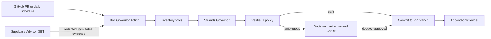

# Doc Governor

Doc Governor is a Strands-powered GitHub Action that governs Markdown created by coding agents. It decides whether a document should be kept, merged, marked stale, or blocked for human review before documentation debt reaches the default branch.

## Why it exists

Coding agents are excellent at producing text and poor at maintaining a small set of authoritative documents. A repository slowly accumulates duplicate API notes, stale status pages, and dates that were changed without evidence. Doc Governor treats documentation as a governed system with five types:

| Type | Lifecycle |
| --- | --- |
| `contract` | Update the canonical document when its source dependency changes. |
| `state` | Expires after a short TTL unless a new verification evidence exists. |
| `procedure` | Requires review when commands or operational dependencies change. |
| `evidence` | Immutable, dated, and never overwritten. |
| `decision` | Superseded by a newer decision instead of silently deleted. |

The agent creates a correction commit on the pull request branch for safe changes, even when a separate high-risk finding still blocks the pull request. It blocks ambiguous, destructive, legal, public-copy, and unsupported-state changes and leaves a decision card in the pull request. A maintainer adds the `docgov-approved` label to authorize a one-time rerun for the current commit.

The model is reserved for semantic classification and ambiguity. Hashes, dependency matching, TTL checks, path boundaries, trust decisions, Supabase Advisor evidence, and ledger writes are deterministic and can run without AWS.

## Quick start

Requirements: Python 3.12+ and a GitHub repository. An AWS role that can invoke the selected Amazon Bedrock model through GitHub OIDC is needed only when semantic model checks are enabled. Strands supports Python 3.10+; the action uses Python 3.12 for a reproducible runtime. The default install contains only the deterministic engine; install the `bedrock` extra to enable Strands.

1. Add `.docgov/catalog.yaml` to your repository. `docgov init` can generate a proposal.
2. Copy `.github/workflows/docgov-review.yml` from this repository. It checks out pull request content as data, enables write/OIDC access only for same-repository PRs, and runs fork PRs read-only. The essential action step is:

```yaml
name: Doc Governor
on:
  pull_request:
    types: [opened, synchronize, reopened, labeled]
permissions:
  contents: write
  pull-requests: write
  checks: write
jobs:
  govern:
    runs-on: ubuntu-latest
    steps:
      - uses: SophieYu04/doc-governor@v0.2.9
        with:
          mode: review
          base_sha: ${{ github.event.pull_request.base.sha }}
          head_sha: ${{ github.event.pull_request.head.sha }}
          apply: ${{ github.event.pull_request.head.repo.full_name == github.repository }}
          approved: ${{ github.event.action == 'labeled' && github.event.label.name == 'docgov-approved' }}
          enable_model: false
        env:
          GITHUB_TOKEN: ${{ secrets.GITHUB_TOKEN }}
```

3. Read the repository's exact GitHub OIDC subject prefix with `gh api repos/OWNER/REPO/actions/oidc/customization/sub --jq .sub_claim_prefix`. In `infra/aws/github-oidc-trust-policy.json`, replace `<AWS_ACCOUNT_ID>` and `<GITHUB_SUB_CLAIM_PREFIX>` with the account ID and that complete prefix. This supports both name-based and immutable owner/repository-ID subjects; do not guess the subject from the repository name.
4. Create a least-privilege AWS role with that trust policy and `infra/aws/bedrock-inference-policy.json`, replacing its account ID too, then set the role ARN as the repository variable `DOCGOV_AWS_ROLE_ARN`. The Bedrock policy permits only the selected US inference profile and its three documented destination-region foundation models. The workflow exchanges GitHub OIDC for short-lived credentials only on same-repository pull requests; forks remain deterministic and receive no AWS identity.
5. Run `docgov init` once and review the generated Catalog proposal.

The OIDC subject lookup follows [GitHub's AWS guidance](https://docs.github.com/en/actions/how-tos/secure-your-work/security-harden-deployments/oidc-in-aws), including immutable repository subjects for newer repositories. The destination-model grants follow [Amazon Bedrock's geographic cross-Region IAM requirements](https://docs.aws.amazon.com/bedrock/latest/userguide/geographic-cross-region-inference.html). Governor responses use the current [Strands structured-output invocation](https://strandsagents.com/docs/user-guide/concepts/agents/structured-output/) and fail closed on validation or timeout errors.

Fork pull requests run in read-only mode. Never use `pull_request_target` to execute untrusted pull request code or expose repository secrets.

Each PR receives an idempotent GitHub Check and one updatable decision-card comment. A successful approved run removes `docgov-approved`; a new commit must be evaluated again.

## CLI

```sh
python -m venv .venv
source .venv/bin/activate
python -m pip install -e '.[dev]'

docgov init
docgov review --base BASE_SHA --head HEAD_SHA
docgov audit
SUPABASE_ACCESS_TOKEN=... docgov audit --apply \
  --supabase-projects 'staging=PROJECT_REF,production=PROJECT_REF'
docgov verify
docgov verify --strict docs/architecture/API.md
```

The default CLI mode is deterministic and offline. Strict verification is read-only and exits with status `2` when a requested tracked Markdown file is stale, expired, unregistered, changed after verification, or has a changed dependency fingerprint. It reports one of four trust scopes: `current_fact`, `rationale_only`, `historical_evidence`, or `untrusted`.

For a repository's first reviewed Catalog only, record the maintainer-approved hashes without changing documentation dates:

```sh
docgov baseline --approved
docgov verify --strict
```

The baseline command writes only `.docgov/ledger.jsonl`. PR review accepts a matching verification record when both the document hash and its dependency fingerprint match the checked-out head; it does not immediately mark that document stale again. Documents already quarantined as `stale` stay unreadable through strict verification without creating repeat PR noise. Future source changes invalidate the matching document until it is updated and verified again. Set `DOCGOV_ENABLE_MODEL=1`, pass `--enable-model`, and install `.[bedrock]` only when semantic classification and duplicate reasoning are needed.

A model-enabled decision includes a privacy-safe `model_trace` containing only tool and model identifiers, never document text or reasoning. The Strands loop must call the bounded `repository_snapshot` tool exactly once or the run fails closed. A model-only finding cannot update content or mark a document stale; only an exact or additive new-file duplicate can proceed to deterministic boundary checks. Every other model-only finding requires a human decision.

### Read-only Supabase Advisor evidence

Audit mode can fetch the Security and Performance Advisor through Supabase Management API `GET` endpoints. Use a fine-grained token with only `advisors_read`, store it as `SUPABASE_ACCESS_TOKEN`, and pass named project refs through `--supabase-projects`.

The collector writes an immutable JSON snapshot only when an environment's Advisor fingerprint changes. Snapshots contain counts, lint names, and one-way hashes; entity names, metadata, cache keys, descriptions, details, project refs, and raw responses are not stored. Fetching every configured environment must succeed before any evidence file is written.

Register the evidence directory as an `evidence` taxonomy path and add it to each affected document's `depends_on` list:

```yaml
taxonomy:
  evidence:
    - docs/security-evidence/**

documents:
  - path: docs/status/RELEASE.md
    type: state
    depends_on:
      - docs/security-evidence/supabase-advisors/**
```

When a new snapshot appears, the same audit treats it as source evidence and marks dependent State, Contract, or Procedure documents stale. A maintenance pull request then contains the immutable snapshot, Catalog status change, and append-only ledger record. Unchanged Advisor results create no commit or pull-request noise.

Repositories with a separate canonical documentation branch can check its tree without switching branches:

```sh
docgov verify --strict --ref codex/appstore-release docs/architecture/API.md
```

The strict scan considers only Git-tracked Markdown. Generated output, dependency checkouts, and other untracked notes never become documentation authority accidentally. New untracked source files that match a declared dependency still invalidate the corresponding document immediately.

## Repository layout

- `.docgov/catalog.yaml`: central document types, dependencies, owners, TTLs, and protected paths.
- `.docgov/ledger.jsonl`: append-only verification and mutation ledger.
- `docgov/`: the CLI, deterministic governance engine, Strands wrapper, GitHub reporter, and Supabase adapter.
- `examples/supabase-demo/`: a small fixture that demonstrates Edge Function and status-document drift.
- `.github/workflows/`: pull request, daily audit, and initial Catalog proposal workflows.

Supabase Markdown may include a machine-readable marker such as `<!-- docgov:supabase-inventory {"functions":["health-check"]} -->`; the source adapter exposes these markers to the verifier and Governor without treating them as a second source of truth. The remote adapter is separate and read-only: it records sanitized Advisor state but never executes SQL, deploys functions, or changes a Supabase project.

## Architecture



## Demo

Run the complete deterministic scenario locally:

```sh
python scripts/demo.py
```

The fixture simulates a coding agent adding an Edge Function, creating a duplicate API document, refreshing a State date without evidence, and changing protected public copy. Doc Governor synchronizes the source-backed API and Edge inventory, removes the duplicate, preserves the protected file, and returns `action_required` for the two human decisions. Use `--keep` to inspect the temporary repository. A scheduled audit demonstrates TTL expiry without a code change.

After configuring AWS credentials with Bedrock access, run the identical scenario through the real Strands loop:

```sh
python scripts/demo.py --enable-model --keep
```

The JSON output proves `model_used: true` and shows the redacted `repository_snapshot` tool trace. The deterministic run remains the zero-credential path for judges and contributors.

## Development and tests

```sh
python -m pytest -q
python scripts/demo.py
python -m docgov --json verify
```

The test suite uses temporary repositories and a mocked Strands boundary; no AWS credentials are needed for deterministic tests.

## Disclosure

This project was created as a new hackathon project. Its problem statement was informed by maintaining a separate mobile application repository, but no private source code, credentials, production data, or deployment artifact is included here. Any generic inventory ideas adapted from prior work are reimplemented and tested in this repository.

## License

Apache-2.0. See [LICENSE](LICENSE).
